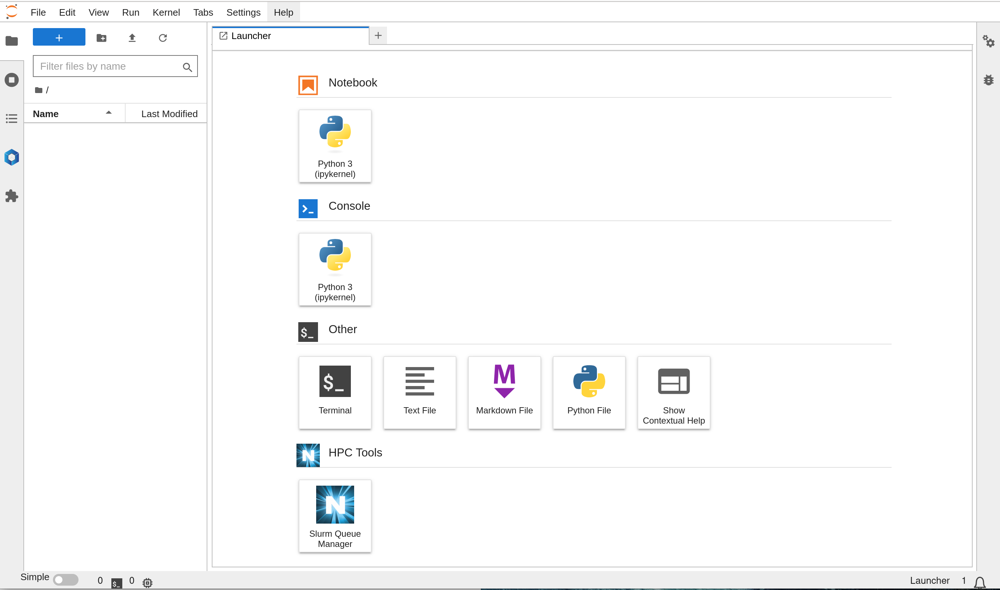
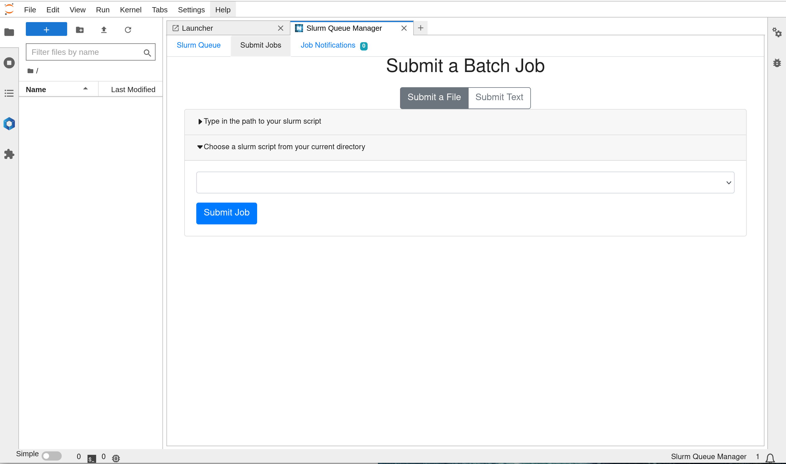
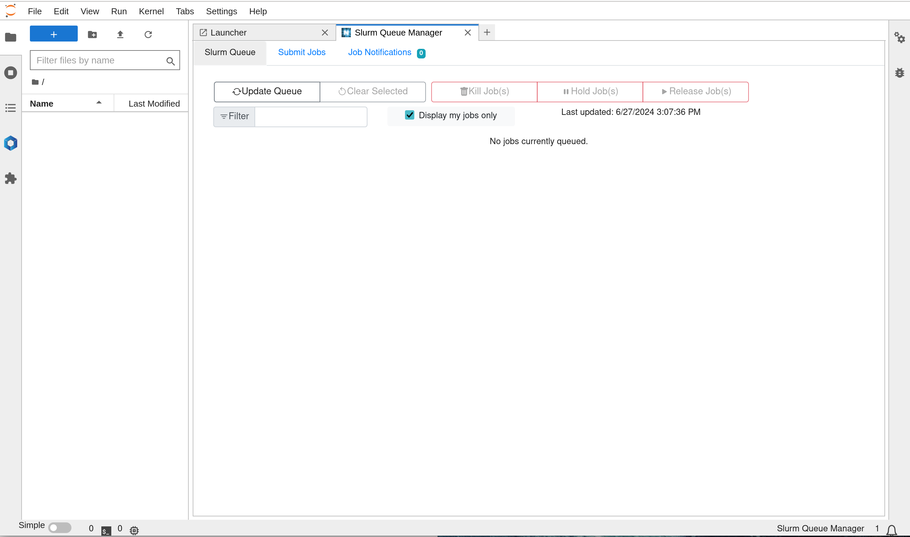
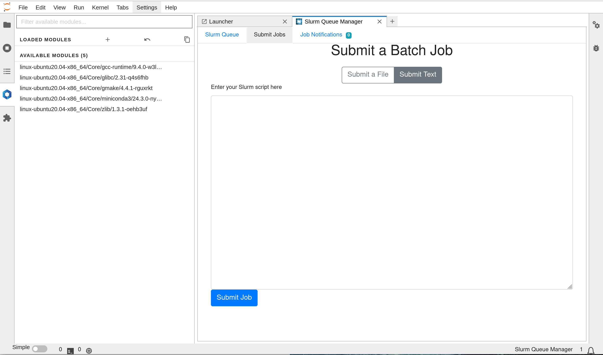

# multi-nodes-slurm-cluster-docker (ubuntu 20.04)

Fully Dockerized Distributed Slurm cluster with CPU/GPU partition and Jupyterlab HPC extensions for Multi-nodes deployment using docker-compose.
<div align="center">
</div>

It consist of the following services:
- NFS Server node (for shared storage )
- MariaDB node (for storage of accounting data)
- phpmyadmin node ( for web sql client)
- Jupyterlab node (notebook, slurm client)
- Storage node (munge, slurmdbd)
- Master node (munge, slurmctld-controller)
- compute GPU nodes x3 (munge, slurmd, nvidia-gpu)
- compute CPU nodes x2 (munge, slurmd)

Optional:
- JupyterHub - multi-user notebook server
- MySQL Database replication
- Slurm Master Node Backups

The slurm version is `v19.05.5`

```
admin@slurmnode6:~$ sinfo
PARTITION AVAIL  TIMELIMIT  NODES  STATE NODELIST
slurmgpu     up   infinite      3   idle slurmnode[1-2,4]
slurmgpu     up   infinite      1   down slurmnode6
slurmcpu*    up   infinite      2   idle slurmnode[3,5]

admin@slurmnode6:~$ sinfo -s
PARTITION AVAIL  TIMELIMIT   NODES(A/I/O/T)  NODELIST
slurmgpu     up   infinite          0/3/1/4  slurmnode[1-2,4,6]
slurmcpu*    up   infinite          0/2/0/2  slurmnode[3,5]
```
```
admin@slurmnode6:~$ slurmd -C
NodeName=slurmnode6 CPUs=24 Boards=1 SocketsPerBoard=1 CoresPerSocket=12 ThreadsPerCore=2 RealMemory=56153
UpTime=0-02:55:22
```
<br />

## Status
On-going developments and improvement works

## Pre-requisites 
1. Supported OS (tested on ubuntu 20.04+, should work on other platform with docker/nvidia-container-toolkit support)

2. Host PC/VM with docker installed
```
curl -fsSL https://get.docker.com -o get-docker.sh 
sh get-docker.sh
```
3. Nvidia-Container-Toolkit
```
curl -fsSL https://nvidia.github.io/libnvidia-container/gpgkey | sudo gpg --dearmor -o /usr/share/keyrings/nvidia-container-toolkit-keyring.gpg \
  && curl -s -L https://nvidia.github.io/libnvidia-container/stable/deb/nvidia-container-toolkit.list | \
    sed 's#deb https://#deb [signed-by=/usr/share/keyrings/nvidia-container-toolkit-keyring.gpg] https://#g' | \
    sudo tee /etc/apt/sources.list.d/nvidia-container-toolkit.list

sudo apt update

sudo apt-get install -y nvidia-container-toolkit

sudo nvidia-ctk runtime configure --runtime=docker

cat /etc/docker/daemon.json

sudo systemctl restart docker
```

## Related Projects

## single node slurm cluster docker
https://github.com/minyang-chen/single-node-slurm-cluster-docker

#### slurm job samples
https://github.com/minyang-chen/slurm-job-samples
<br />

## How to Deploy

@TODO


## Update Cluster Configuration 

#### etc/slurm-llnl/slurm.conf
this is the main cluster configuration file 

#### etc/slurm-llnl/gres.conf
this is the nodes GPU configuration file 

#### etc/slurm-llnl/slurmdbd.conf
this is the cluster accounting configuration file 

#### etc/slurm-llnl/slurm.no_tres
this is the main cluster configuration file without tres enablement 

## Using Jupyterlab Slurm Extensions

#### HPC-Tools (jupyterl_slurm)
GUI extension that support management of slurm jobs submission and status monitoring 
see screenshots here:




#### Module Softwares (jupyterlmod)
GUI extension that support viewing of available and installed modules in the cluster
see screenshot here:


## Todo list
- add monitor node
- standardize multi-user /home NFS storage design
- standardize multi-user /sw NFS storage design
- add LDAP and other common authentication methods
- add dynamic code workspace supported ( gitpod like)

#### Contribution, Bugs fixes and Support
Welcome, please create an issue.

#### Acknowledgements
Inspired by works from other Linux Distribution 
rockylinux: [slurm-docker-cluster](https://github.com/giovtorres/slurm-docker-cluster)
CentOS: [slurm-in-docker](https://github.com/SciDAS/slurm-in-docker)

